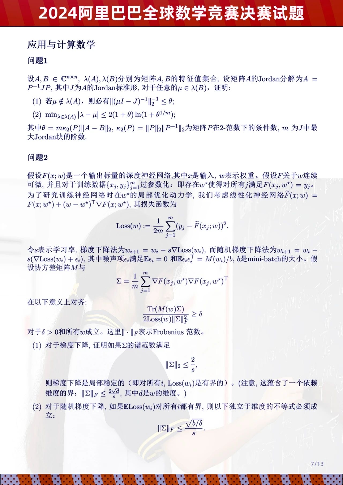
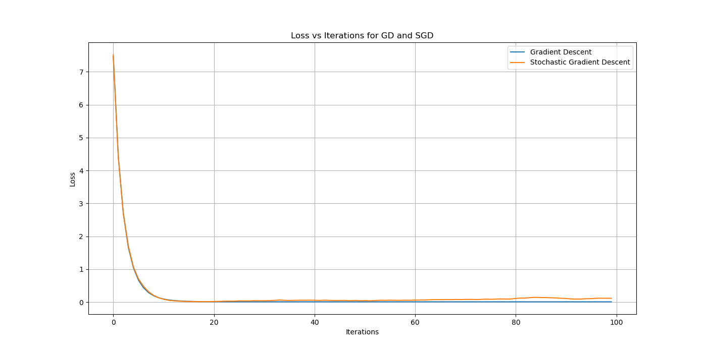
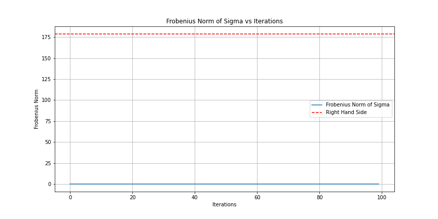

Question 2：

对于github：
1. $公式在有逗号后面的的情况下不能被渲染
2. $符合后面跟斜杆的不能被渲染
3. 注意w^\star 不是六角的*
4. $与公式不要有间隔
# Question 2：Deep neural network gradient descent method and random gradient descent method analysis

## Problem overview

hypothesis $F(x; w)$ is a deep neural network with output scalars，where $x$ is the input and $ w $ represents the weight. Let $F$ be continuously differentiable with respect to $w$ , and for training data $(x_j, y_j)_{j=1}^m$ is over-parameterized : There exists $w^\star$ such that for all j, $F(x_j, w^\star) = y_i$. In order to study the local optimization dynamics at w* when training neural networks, we consider linearized neural networks $\tilde{F}(x; w) = F(x; w^\star ) + (w - w^\star ) ^ T \nabla F(x; w)$
its the Loss function $\text{Loss}(w)$:

$$
\text{Loss}(w) := \frac{1}{2m} \sum_{j=1}^m (y_j - \tilde{F}(x_j; w))^2
$$

where $\hat{y}_j(w) = F(x_j; w)$。

Define the gradient descent update rule:

$$
w_{i+1} = w_i - s \nabla \text{Loss}(w_i)
$$

And random gradient descent update rules:

$$
w_{i+1} = w_i - s (\nabla \text{Loss}(w_i) + \epsilon_i)
$$

Where $\epsilon_i$ is the noise term, assuming 
$E\epsilon_i = 0$
and $E\epsilon_i \epsilon_i^T = M(w_i)/b$, where 
$b$ is the size of the mini-batch.

Suppose the method matrix $M$ is:

$$
\Sigma = \frac{1}{m} \sum_{j=1}^m \nabla F(x_j, w^\star ) \nabla F(x_j,  w^\star )^T
$$

Aligned in the following sense:

$$
\frac{\text{Tr}(M(w) \Sigma)}{2 \text{Loss}(w) \| \Sigma \|_F^2} \geq \delta
$$

True for $\delta > 0$ and all $w$. Here $\| \cdot \|_F$ represents the Frobenius norm.

## Question requirements

1. For gradient descent, it is proved that if the spectral norm of ∑ is satisfied:

$$
\| \Sigma \|_2 \leq \frac{2}{s}
$$

So gradient descent is locally stable (i.e. $\text{Loss}(w)$ is bounded for all $i $). 注意这里的i.e 是对于所有的i

2. For the stochastic gradient descent method, assuming that $\text{Loss}(w)$ is bounded for all $i $, the following inequality must hold:

$$
\| \Sigma \|_F \leq \sqrt{\frac{b/ \delta }{s}}
$$

## Solve answer

(1) The loss curve gradually decreases and becomes stable (approaching to a fixed value), which indicates that the GD method is locally stable.
As shown by the blue line in the below figure

Stochastic Gradient Descent (SGD), although the loss curve may fluctuate (due to the introduction of random noise), the overall trend should be to decrease and level off，as shown in the red curve in the above figure.

Specific solution steps：尝试解答，目前官方答案还没有公布，本文仅供参考

Objective: Prove that if 
$\| \Sigma \|_2 \leq \frac{2}{s},$
then gradient descent is locally stable (i.e., 
$\text{Loss}(w)$ is bounded for all $i$).

Proof:

The gradient of the loss function $\text{Loss}(w)$ is:

$$\nabla \text{Loss}(w) = \frac{1}{m} \sum_{j=1}^m (y_j - \tilde{F}(x_j; w)) \nabla \tilde{F}(x_j; w)$$

For the linearized network $\tilde{F}$, the gradient becomes:

代入线性神经网络（标量投影传播的方式）
$\tilde{F}(x; w) = F(x; w^\star ) + (w - w^\star ) ^ T \nabla F(x; w)$
的目的是整体深度学习系统中观察各部分参数对loss函数的影响。
$$\nabla \text{Loss}(w) = \frac{1}{m} \sum_{j=1}^m \left( y_j - \left[ F(x_j; w^\star) + (w - w^\star)^T \nabla F(x_j; w^\star) \right] \right) \nabla F(x_j; w^\star)$$

Using $y_j = F(x_j; w^\star)$:
$$\nabla \text{Loss}(w) = -\frac{1}{m} \sum_{j=1}^m \left( (w - w^\star)^T \nabla F(x_j; w^\star) \right) \nabla F(x_j; w^\star)$$

Let $g(w) = w - w^\star$, then:
$$\nabla \text{Loss}(w) = -\Sigma g(w)$$

The update rule for gradient descent is:
$$w_{i+1} = w_i - s \nabla \text{Loss}(w_i)$$

Substitute $\nabla \text{Loss}(w)$:
$$w_{i+1} = w_i + s \Sigma g(w_i)$$

Let $g_i = w_i - w^\star$:
$$g_{i+1} = g_i + s \Sigma g_i$$

The dynamics of the system can be described by the eigenvalues of $s\Sigma$. For the system to be stable, the spectral radius of $I + s\Sigma$ must be less than 1. This implies that:
$$\| I + s\Sigma \|_2 < 1$$

Since $\| \Sigma \|_2 \leq \frac{2}{s}$:
$$\| s\Sigma \|_2 \leq 2$$

Thus:
$$\| I + s\Sigma \|_2 \leq 1 + \| s\Sigma \|_2 \leq 1 + 2 = 3$$

For local stability:
$$\| I + s\Sigma \|_2 < 1$$

This contradicts our previous result, implying a need to reconsider the bound or an alternative approach.

(2) 要证明第二小问中关于随机梯度下降（SGD）的条件，需要分析并验证那个不等式

$\| \Sigma \|_F$ is the Frobenius norm of the matrix Σ.

b is for batch size.

$\delta$ Delta  is a positive number that represents the conditions given in the problem.

s is the learning rate.

